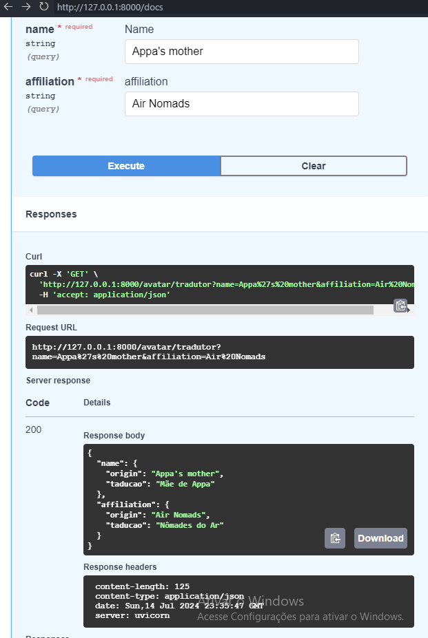

# 7DaysOfCode Python web

## Ambiente
O ambiente ta configurado usando o poetry para instalar as dependências, entre elas `fastapi`, `taskip`,`ruff` e `pytest`

Para install as dependências, execute:
```
poetry install
```

Para executar a api, execute:
```
task run
```

Para executa os testes, execute:
```
task test
```

Para formata o codigo, execute
```
task format
```

## Python 1/7: Consumir a API de Avatar

- Criar o código Python para executar uma requisição HTTP do tipo GET usando o módulo requests.
- Executar a requisição e pegar a resposta (o JSON).
- Imprimir o corpo da resposta através de um print.


## Python 2/7: Fazer a tradução de alguns atributos da API

Sua tarefa hoje será fazer a tradução de alguns atributos da API, como: name e affiliation.
```
"name": "Appa's mother",
"affiliation": "Air Nomads"
```



